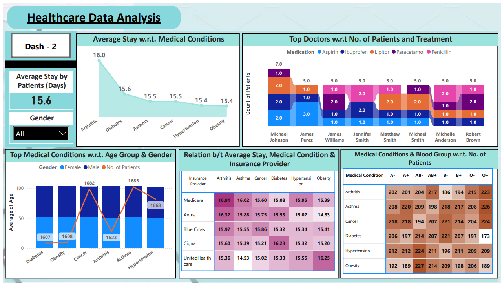
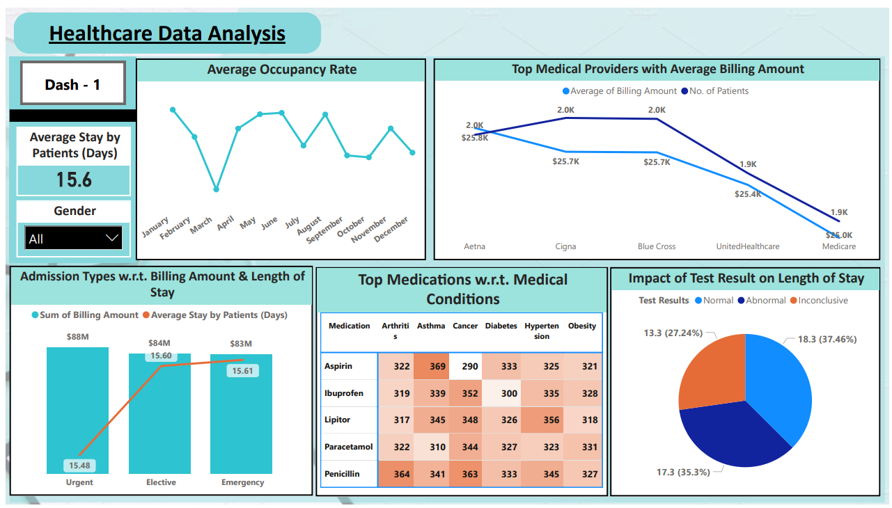

# Project : Healthcare
## Objective
- You're a Data Analyst working for a big healthcare chain.
- You have been provided with a Data set containing data about patients and their medical conditions.
- The main goal of the report are to:
    1. Find ways to help patients get better care.
    2. Make the hospital run more smoothly.
    3. Help the hospital make smart money decisions.

## Dataset

## Key Performance Indicators (KPIs)
1. What is the average length of stay for patients, and how does it vary by medical condition?
2. Which doctors have the highest patient volumes, and what are their most common treatments?
3. How do billing amounts correlate with length of stay, medical condition, and insurance provider?
4. What are the most common medical conditions treated, and how do they distribute across age groups and genders?
5. Is there a relationship between blood type and specific medical conditions?
6. What is the hospital's occupancy rate over time, and are there any seasonal patterns?
7. How do admission types (Urgent, Elective, etc.) impact billing amounts and length of stay?
8. What are the most frequently prescribed medications, and how do they relate to specific medical conditions?
9. How do test results correlate with length of stay and patient outcomes?
10. Which insurance providers are most common, and how do their average billing amounts compare?

## Tool Used:
**Power BI**

## Working
- First I have transformed the data using Power Query Editor in PowerBI to verify any missing values.
- Made sure that data is consistent and clean and checked if correct data type, data format and values are used.
- As the KPIs are more so I have divided the report in 2 dashboards.

## Dashboards

